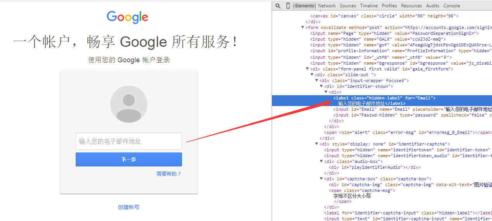
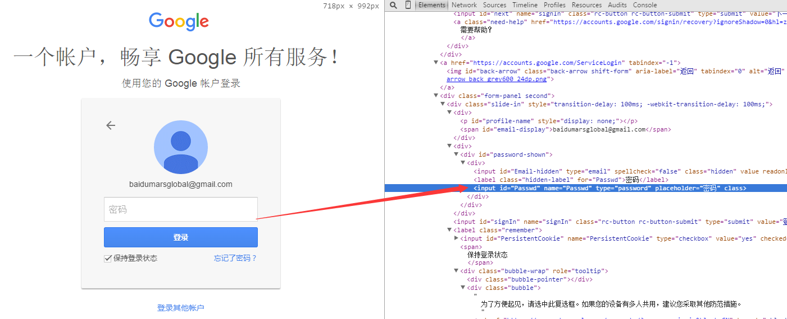
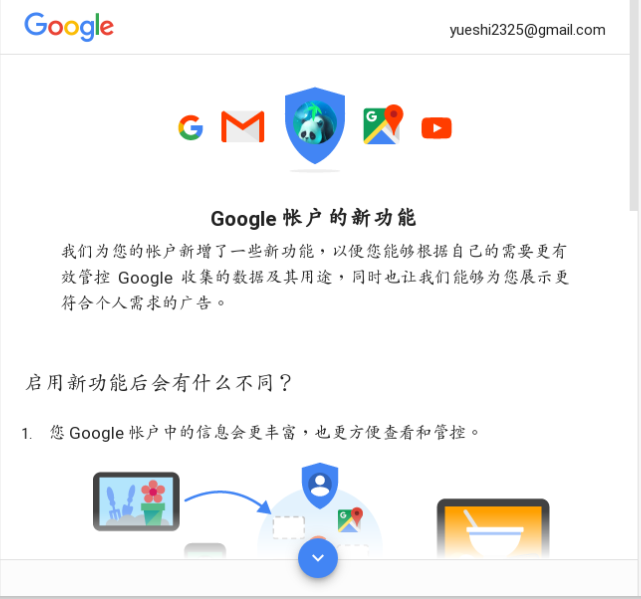
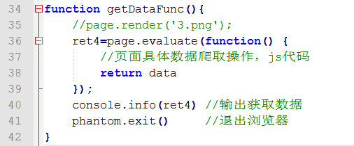

### PhantomJs
---
安装PhantomJS
下载对应版本PhantomJS，解压缩即可

1. PhantomJS官网下载地址： http://phantomjs.org/download.html

2. PhantomJS下载：  wget https://bitbucket.org/ariya/phantomjs/downloads/phantomjs-2.1.1-linux-x86_64.tar.bz2

3. 解压缩：   tar xvfj phantomjs-2.1.1-linux-x86_64.tar.bz2

4. 查看帮助： /home/simejiglobal/phantomjs/bin/phantomjs --help

5. 在examples文件中提供了很多demo代码可以直接使用，例：脚本代码hello.js

   
   
   执行命令：  phantomjs hello.js
   
   执行接口：命令行输出 Hello，world！
   
   

### 模拟Google Play登录
---
1. 访问Google Play登录网址 https://accounts.google.com/ServiceLogin 
   gp_login.js脚本中创建虚拟浏览器，打开google play的登录网页
   page.open()函数：浏览器打开指定url页面，并执行某些操作
   
   说明： 由于网络原因，浏览器页面加载时间可能会很长，使用setTimeout函数延迟登录操作，等待10秒浏览器内容加载完全后，再进行后续操作
   
2. 打开google play登录页面后，可以找到用户名输入框的html控件id为Email
   
   使用js代码模拟用户输入gp账号，将邮箱账号添加到输入框中，并点击下一步
   page.evaluate()函数代表在浏览器中执行的js代码
   
   

3. 输入账号后，页面切换到输入密码，密码输入框控件id为Passwd
   
   模拟用户数据账号密码，操作同上一步，输入gp密码后，点击“登录”即可登录Google play账号
   
   
   
4. 打开需要爬取数据的页面
   	
   函数page.render('1.png')将当前页面截图，可以看到已成功登录GP账号
   
   
5. 具体数据爬取，在 page.evaluate中添加数据爬取代码，将爬取内容返回到ret4变量中，数据爬取结束后，退出浏览器 phantom.exirt() 

   


### phantomjs click bug
---
phantomjs中，除了button元素之外的dom元素无法触发click事件
问题解决方案：自己创建Event：createEvent

```
var ev = document.createEvent('MouseEvents');
ev.initMouseEvent('click', true, true, window, 1, 0, 0, 0, 0, false, false, false, false, 0, null);
document.getElementsByTagName('a')[0].dispatchEvent(ev); 
```

